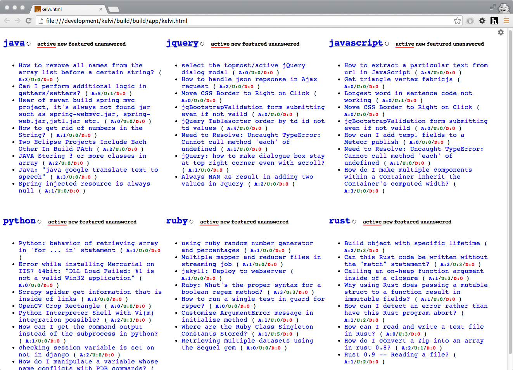

# Kelvi

Kelvi is a minimalistic themed **stackoverflow questions monitor** on your favourite topic. If you are a fanatic user of stackoverflow and live in it, this should be very handy to monitor the questions on your favorite topics.

Topics are [tags from stackoverflow](https://stackoverflow.com/tags).

## How to use

1. Get the [zip](build/kelvi-1.0.zip) package and unzip in any folder you want
2. Run kelvi.html

## Customizations

Kelvi allows you to make customizations as much as possible. Since this is designed for developers, It allows customizations to most of the part. 

* Add / Remove new topics to watch
* Modify the update frequency
* Modify number of questions to be displayed per topic ( 8(2^3) seems to be optimal, 5 is less and more than 8 is lot)
* Modify how many different watches you want to track on a topic. (Active, New, Unanswered, Featured). Some topics may get Featured rarely, in that case you can disable the watch to not fetch data.
* What is the default watch to be displayed, while launching the app.

## Chrome App

Kelvi is also available as Chrome app. Get the [chrome app package](build/kelvi-chrome-app-1.0.zip) and load as [unpacked Extension](http://developer.chrome.com/extensions/getstarted.html#unpacked).

## Credits:

* [Coffeescript](http://coffeescript.org/)
* [AngularJS](http://angularjs.org/)
* [jQuery](http://jquery.com/)
* [jaadi](https://github.com/msubra/jaadi)
* [nodejs](http://nodejs.org/)
* [Sublime Text](http://www.sublimetext.com/)

